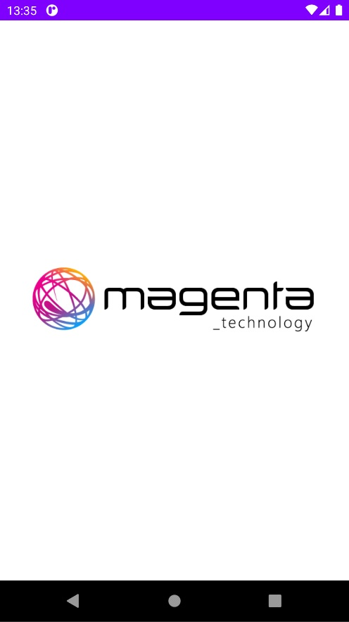

# О приложении

Тестовое задание на должность Junior Android Developer компании Magenta Technology

  

# Возможности приложения
### 1. Экран "Все картинки"
- подгрузка картинок с пагинацией (постанично)
- при подгрузке страницы отображается прогресс-бар
- пользователь может лайкать понравившиеся картинки
- в офлайн режиме отображается снэкбар с текстом
- присутствует анимация списка

    

### 2. Экран "Любимые картинки"
- отображает картинки, отмеченые лайком
- при снятии лайка (дизлайке) картинка с этого экрана пропадает
- присутствует анимация списка

  

# Используемые технологии
- Kotlin + Coroutines
- Flow + LiveData
- Paging Library v3
- Clean Architecture
- Retrofit
- Room
- Hilt
- Glide
- Jetpack Navigation
- JUnit 5